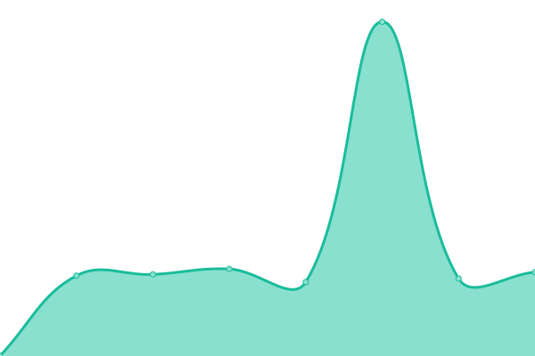

# [📈 Status em tempo real](https://ouvidor-digital.github.io/status-page): <!--live status--> **Todos os sistemas estão funcionando corretamente**

This repository contains the open-source uptime monitor and status page for [Ouvidor Digital](https://ouvidordigital.com), powered by [Upptime](https://github.com/upptime/upptime).

With [Upptime](https://upptime.js.org), you can get your own unlimited and free uptime monitor and status page, powered entirely by a GitHub repository. We use [Issues](https://github.com/ouvidor-digital/status-page/issues) as incident reports, [Actions](https://github.com/ouvidor-digital/status-page/actions) as uptime monitors, and [Pages](https://ouvidor-digital.github.io/status-page) for the status page.

## [📈 Live Status](https://demo.upptime.js.org): <!--live status--> **Todos os sistemas estão funcionando corretamente**

<!--start: status pages-->
<!-- This summary is generated by Upptime (https://github.com/upptime/upptime) -->
<!-- Do not edit this manually, your changes will be overwritten -->
<!-- prettier-ignore -->
| URL | Status | Histórico | Tempo de resposta | Tempo de disponibilidade |
| --- | ------ | ------- | ------------- | ------ |
|  [Portal](https://portal.ouvidordigital.com.br) | 🟩 OK | [portal.yml](https://github.com/ouvidor-digital/status-page/commits/HEAD/history/portal.yml) | 

 191ms
     
 | 

<a href="https://status.ouvidordigital.com.br/history/portal">100.00%</a>
    

|  API - Ouvidor Digital | 🟩 OK | [api-ouvidor-digital.yml](https://github.com/ouvidor-digital/status-page/commits/HEAD/history/api-ouvidor-digital.yml) | 

 73ms
     
 | 

<a href="https://status.ouvidordigital.com.br/history/api-ouvidor-digital">100.00%</a>
    

|  [Sites dos Canais](https://ouvidordigital.com.br/od) | 🟩 OK | [sites-dos-canais.yml](https://github.com/ouvidor-digital/status-page/commits/HEAD/history/sites-dos-canais.yml) | 

 265ms
     
 | 

<a href="https://status.ouvidordigital.com.br/history/sites-dos-canais">100.00%</a>
    

|  [Portal do Denunciante](https://canal.ouvidordigital.com.br/od/form) | 🟩 OK | [portal-do-denunciante.yml](https://github.com/ouvidor-digital/status-page/commits/HEAD/history/portal-do-denunciante.yml) | 

 812ms
     
 | 

<a href="https://status.ouvidordigital.com.br/history/portal-do-denunciante">100.00%</a>
    

<!--end: status pages-->

[**Visit our status website →**](https://ouvidor-digital.github.io/status-page)

## 📄 License

- Powered by: [Upptime](https://github.com/upptime/upptime)
- Code: [MIT](./LICENSE) © [Ouvidor Digital](https://ouvidordigital.com)
- Data in the `./history` directory: [Open Database License](https://opendatacommons.org/licenses/odbl/1-0/)
